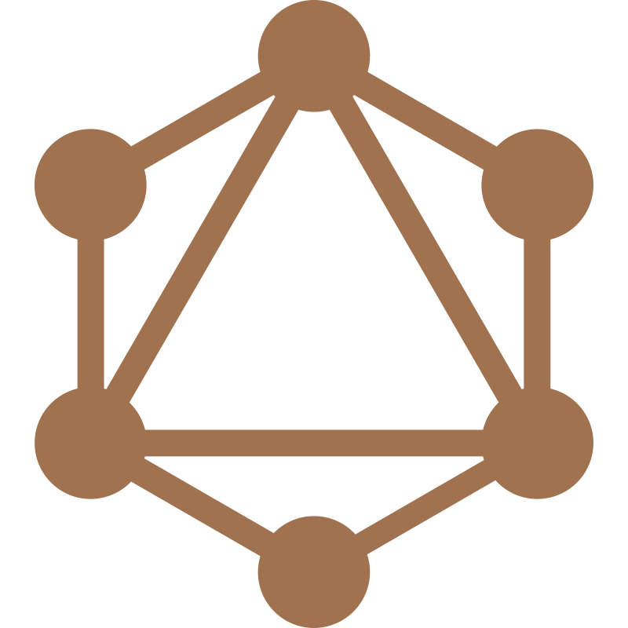

<h1 align="center">✨Hi, I'm Javier✨</h1>
<h3 align="center">🇨🇱 A passionate software engineer from Chile 🗿</h3>

- 🌱 I’m currently learning **Nuxt, UI/UX and project management**
- 🎓️ I am a **Programmer Analyst** and **Software Engineering** graduate.
- ⚡ Fun fact: Everyone knows me by the nickname **Ratapan**.

<h3 align="left">Connect with me:</h3>

<h3 align="left">Languages ​​and tools I love:</h3>

 

   

   
  
      
 
  <a href="https://expressjs.com" target="_blank" rel="noreferrer"> 
 
   

